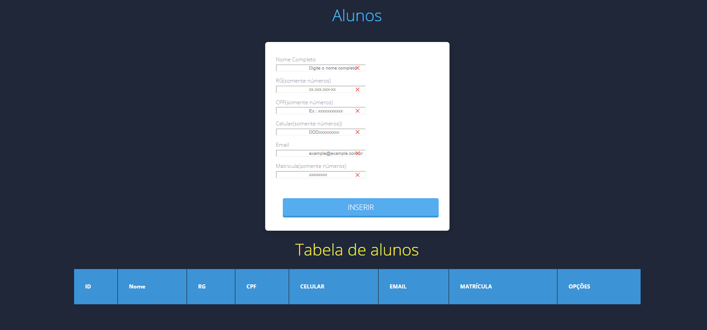

#  NoiteDev

## Description 

This project illustrates an example of a simple registrer of students for learning.

## Demostration



## Starting

To run the project, you will need to install the following programs:

- [MySQL: a toolkit, necessary to carry out the project](https://www.mysql.com/)
- [XAMPP: a server to upload the database](https://www.apachefriends.org/pt_br/index.html)
- [Nodejs: Required to create the project](https://nodejs.org/en/)
- [VS Code: For project development] (https://code.visualstudio.com/)

## ⌨️ Development

Use Gitpod, a free online dev environment for GitHub.

[](https://gitpod.io/#https://github.com/Suspir0n/noiteDev.git)

Or use code locally using:
```bash
cd "Directory of your preference"
git clone https://github.com/Suspir0n/noiteDev.git

### Construction

To build the project with Nodejs, execute the commands below:

```bash
npm init
```

The command will download the file called *package.json*.

With that, MySQL would be missing. For such action, execute the command below:

```
npm install mysql --save
```

The command will download all the dependencies you need to use this tool.

## Features

The project can be used as a template to start the development of a Javascript project using Nodejs. It also demonstrates in a practical way how to create a Student Register and also demonstrate in a table in nodejs quickly and easily.

## Configuration

To execute the project, it is necessary to use VsCode or an IDE of your preference, so that it identifies the dependencies necessary for execution in the repository. Once the project is imported, it will be possible to test its functionality in real time.

As you will use the database, you will need the Workbench to be able to test your database or in case of an error you can easily resolve it

## Contributions

Contributions are always welcome! I hope I have helped someone in need.
